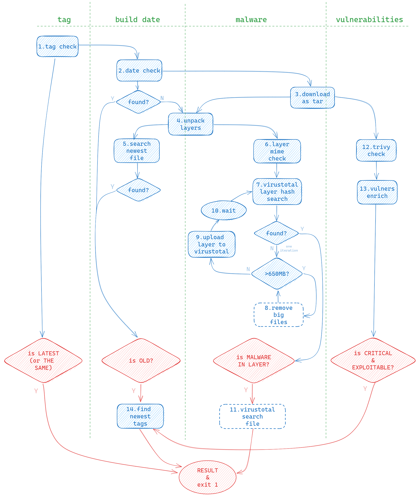

# Public OCI-Image Security Checker

## What is it?

PISC (Public OCI-Image Security Checker) is a bash script which checks the following:
* **malware** (exploits, backdoors, crypto-miners, etc) by [virustotal](https://www.virustotal.com/)
* exploitable critical **vulnerabilities** by [trivy](https://github.com/aquasecurity/trivy) and [vulners](https://vulners.com/)
* old **creation date**
* [non-version](https://docs.docker.com/engine/security/trust/#image-tags-and-dct) **tag** (optional)
  
It can be used to automatically check the security of public OCI-images before run them in a private environment or before using them as base images for CI/CD process.

## Usage

### Preparation
1. [Get API key](https://support.virustotal.com/hc/en-us/articles/115002088769-Please-give-me-an-API-key) for [virustotal](https://www.virustotal.com/). Standard free end-user account may have limitations.
2. [Get API key](https://vulners.com/docs/apikey/) for [vulners](https://vulners.com/). The free plan has strict limitations.

### Quick Start via Docker
```sh
docker run kapistka/disc:latest /bin/bash scan.sh -l -v <vulners-api-key> -m <virustotal-api-key> kapistka/log4shell:0.0.3-nonroot
```

### Common Start
Look at the [Dockerfile](./Dockerfile) to find dependencies. You need to install `trivy`, `skopeo`, `jq` and other packages depending on the distribution used.
```sh
./scan.sh -l -v <vulners-api-key> -m <virustotal-api-key> kapistka/log4shell:0.0.3-nonroot
```
```
Usage: scan.sh [-h] [-l] [-m virustotal_api_key] [-v vulners_api_key] [-t trivy_token] image_link [-w] [-f filepath]
Available options:
 -h              Print this help and exit
 -l              Check non-version tag (:latest and the same)
 -f file_path    Check all images from file. Example: -f images.txt
 -v api_key      Check vulners.com for exploitable vulnerabilities. Specify vulners API-key, example: -v 0123456789ABCDXYZ
 -m api_key      Check virustotal.com for malware. Specify virustotal API-key, example: -m 0123456789abcdef
 -w              Wait for bypass virustotal.com limits (if it happened)
 -t token        Use trivy server if you can. Specify trivy token, example: -t 0123456789abZ
 image_link      Link to OCI-image
```

## How It Works
1. Image **Tag** is checked for the absence of a digit if it's not digest (this is optional and [can be used](https://docs.docker.com/engine/security/trust/#image-tags-and-dct) in your CI/CD process).
2. [Skopeo](https://github.com/containers/skopeo) [inspect](https://github.com/containers/skopeo/blob/main/docs/skopeo-inspect.1.md) image and get **creation date** (this is the only check that is done if you do not specify additional keys).
3. Image is [downloaded](https://github.com/containers/skopeo/blob/main/docs/skopeo-copy.1.md) localy as tar by [Skopeo](https://github.com/containers/skopeo).
4. Each layer is unpacked into a directory for file analysis.
5. If there is no **creation date** at `step 2` (for example, gcr-distroless images), then we are searching for the newest file in each layer. Creation date of newest file is the image **creation date** (but it's not exactly :open_mouth:).
6. Preparing to send the entire layers for **malware** by [virustotal](https://www.virustotal.com/). Not all layers, but only those that contain [executable files or scripts](https://www.iana.org/assignments/media-types/media-types.xhtml).
7. Take the hashes of the selected layers and [search](https://developers.virustotal.com/reference/search-1) for them on [virustotal](https://www.virustotal.com/).
8. If the layer hash is not found on [virustotal](https://www.virustotal.com/), look at its size. Files larger than 650 Mb [cannot be uploaded](https://developers.virustotal.com/reference/files-upload-url) for virustotal scaning. If the layer size is more than 650 MB, we remove all non [executable files or scripts](https://www.iana.org/assignments/media-types/media-types.xhtml) from above. Then if it still more than 650 MB, we sort its file system from a larger file to a smaller one and remove the files from above until the layer size becomes necessary (this step about reducing loyer size has yet to be done :sweat_smile:).
9. If the layer size is less than 650 Mb, [upload](https://developers.virustotal.com/reference/files-scan) it for scaning on [virustotal](https://www.virustotal.com/). Files [less than 32 Mb](https://developers.virustotal.com/reference/files-scan) and [more than 32 Mb](https://developers.virustotal.com/reference/files-upload-url) have different upload methods.
10. Waiting until [virustotal](https://www.virustotal.com/) completes the scan :sleeping:. After that return to `step 7`, find the necessary hashes and see if the antivirus softwares have detected **malware**.
11. If **malware** is detected in the layer, then we don't know which file is malicious. Recursively divide the layer into parts and upload them to the [virustotal](https://www.virustotal.com/). As a result, we will find out which file in which layer is malicious (this step has yet to be done :sweat_smile:).
12. Checking tar for **vulnerabilities** using [trivy](https://github.com/aquasecurity/trivy). It is possible to use both [standalone mode](https://aquasecurity.github.io/trivy/v0.45/docs/references/modes/standalone/) (preferably for running the script locally) and [client-server mode](https://aquasecurity.github.io/trivy/v0.45/docs/references/modes/client-server/) (preferably for running the script in a container or CI/CD).
13. For critical **vulnerabilities**, [enrich information](https://vulners.com/docs/API_wrapper/tips_and_tricks/#get-full-information-about-a-document-by-id) through [vulners](https://vulners.com/) about `wildExploited` and `EPSS`.
14. If the image **was created** a long time ago (365 days by default) or exploitable **vulnerabilities** were found in it (**Step 13**), then using [Skopeo](https://github.com/containers/skopeo) [looking]((https://github.com/containers/skopeo/blob/main/docs/skopeo-inspect.1.md)) for newer version **tags** for this image.
<p align="center">
  
</p>

## ToDo:
 - Output for CI-runner (option -c)
 - Check the virustotal scan status every 10 seconds (Step 10)
 - Step 11 (enhanced binary search)
 - Step 8 (reducing loyer size)
 - What should we do if the creation date is still not found (Step 5)?
 - Check CVE-SBOM bypass https://github.com/bgeesaman/malicious-compliance
 - Check malware bypass https://raesene.github.io/blog/2023/04/22/Fun-with-container-images-Bypassing-vulnerability-scanners/
 - Check vender's sign
 - Check licence compliance by SBOM
