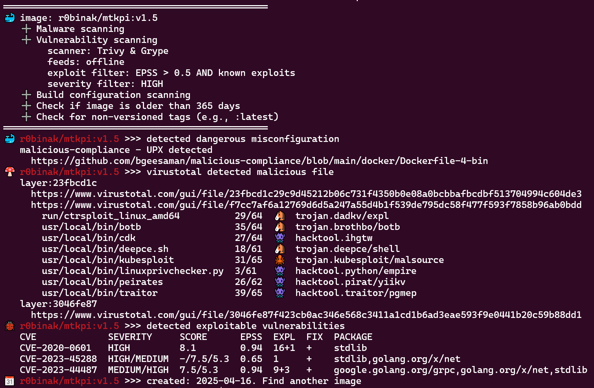

# Public OCI-Image Security Checker

## What is it?

PISC (Public OCI-Image or docker-image Security Checker) is command-line tool to assess the security of OCI container images.  
Exits with code `1` if any of the following conditions are met:
* **malware** 🍄 (exploits 🐙, hack-tools 👾, backdoors 🐴, crypto-miners 💰, etc 💩) by [virustotal](https://www.virustotal.com/)
* exploitable critical **vulnerabilities** 🐞 by [trivy](https://github.com/aquasecurity/trivy), [grype](https://github.com/anchore/grype), [epss](https://epss.empiricalsecurity.com) and [inthewild.io](https://inthewild.io/)
* image **misconfigurations** 🐳 like [CVE-2024-21626](https://www.docker.com/blog/docker-security-advisory-multiple-vulnerabilities-in-runc-buildkit-and-moby/)
* old **creation date** 📆
* [non-version](https://docs.docker.com/engine/security/trust/#image-tags-and-dct) **tag** ⚓ (latest, etc)
  
It can be used to automatically check the security of public OCI images before running them in a private environment or using them as base images in a CI/CD pipeline.
<p align="center">
  
</p>

## Releases here:
* https://hub.docker.com/r/kapistka/pisc/tags
* [changelog](./changelog.txt)

## Usage

### Preparation
[Get API key](https://docs.virustotal.com/docs/please-give-me-an-api-key) for [virustotal](https://www.virustotal.com/). The standard free end-user account has limitations.

### Quick Start via Docker
```sh
docker run kapistka/pisc:latest /bin/bash ./scan.sh -delm --virustotal-key <virustotal-api-key> -i r0binak/mtkpi:v1.5
```

### Quick Start via Docker-image with offline feeds
```sh
docker run kapistka/pisc:latest-feeds /bin/bash ./scan.sh -delm --offline-feeds --virustotal-key <virustotal-api-key> -i r0binak/mtkpi:v1.5
```

### Common Start
Refer to the [Dockerfile](./Dockerfile#L5) for a list of dependencies. You need to install `trivy`, `grype`, `skopeo`, `jq`, and other packages based on the distribution you are using.
```bash
Usage:
  scan.sh [flags] [-i IMAGE | -f FILE | --tar TARFILE]

Flags:
  -d, --date                      Check image age against threshold (default: 365 days).
  --d-days <int>                  Custom threshold for build date check (in days). Example: '--d-days 180'.
  -e, --exploits                  Check for vulnerabilities with known exploits (using Trivy + Grype + inthewild.io + empiricalsecurity.com).
  --epss-and                      Use AND logic to combine EPSS score and exploit presence. If disabled, OR logic is applied (default: OR).
  --epss-min <float>              Minimum EPSS score threshold used for filtering vulnerabilities (default: 0.5).
  -f, --file <string>             Batch scan images from file. Example: '-f images.txt'.
  -h, --help                      Display this help message.
  --ignore-errors                 Ignore errors from external tools and continue execution.
  -i, --image <string>            Single image to scan. Example: '-i r0binak/mtkpi:v1.4'.
  -l, --latest                    Detect non-versioned tags (e.g., ':latest').
  -m, --misconfig                 Scan for dangerous build misconfigurations.
  --offline-feeds                 Use a self-contained offline image with pre-downloaded vulnerability feeds (e.g., :latest-feeds).
  --scanner [trivy|grype|all]     Choose which scanner to use: Trivy, Grype, or both (default: all)
  --severity-min <string>         Minimal severity of vulnerabilities [UNKNOWN|LOW|MEDIUM|HIGH|CRITICAL] default [HIGH]
  --show-exploits                 Show exploit details
  --tar <string>                  Scan local TAR archive of image layers. Example: '--tar /path/to/private-image.tar'.
  --trivy-server <string>         Trivy server endpoint URL. Example: '--trivy-server http://trivy.something.io:8080'. 
  --trivy-token <string>          Authentication token for Trivy server. Example: '--trivy-token 0123456789abZ'.
  -v, --version                   Display version.
  --virustotal-key <string>       VirusTotal API key for malware scanning. Example: '--virustotal-key 0123456789abcdef'.
  --vulners-key <string>          Vulners.com API key (alternative to inthewild.io). Example: '--vulners-key 0123456789ABCDXYZ'.

Additional Notes:
- To authenticate with a registry, refer to 'scan-download-unpack.sh#L14'.  
- To configure exclusions for specific CVEs or other criteria, see 'check-exclusion.sh#L5'.
```

## Usage in CI Pipelines
This utility can be integrated into a CI pipeline to perform a security scan on container images before pushing them to a private registry. Combine this step with image signing and automated registry pushing for a secure DevSecOps workflow. Below is an example configuration:
```yaml
security_scan:
  stage: security
  image: $SECURITY_IMAGE_FEEDS
  script:
    - |
      /bin/bash /home/nonroot/scan.sh -delm --offline-feeds --virustotal-key $VIRUSTOTAL_API_KEY -f ${NEW_IMAGES_FILE}

      # Auto-approve: If the scan fails (exit code >0), the pipeline stops before reaching this point.
  rules:
    - if: $CI_PIPELINE_SOURCE == 'merge_request_event'
```

## Use cases
```bash
# CVE-2024-3094 (XZ Utils) exploit
./scan.sh --virustotal-key <virustotal-api-key> -i r0binak/xzk8s:v1.1
════════════════════════════════════════
🍄 r0binak/xzk8s:v1.1 >>> virustotal detected malicious file
   layer:0f28dfeb
     https://www.virustotal.com/gui/file/0f28dfebbf3451ccfe3d5b11d17bc38cc8d1c4e721b842969466dc7989d835e3
     https://www.virustotal.com/gui/file/dc24581c3500b9640e03c7a4c14cd7c22f88c533b831a7f6a49aaf3ba39fcde4
   layer:230cc513
     https://www.virustotal.com/gui/file/230cc513debf36c5294ba6dd2babd27934bb231362cd8d916ea1c58e9495d38f
     https://www.virustotal.com/gui/file/935cfccfa8d31d0e03f2162e9b46b7f9df77db64efa2e4cfb4dbaebdf94be6d3
       root/liblzma.so.5.6.0.patch  37/64  🐴  trojan.xzbackdoor/cve20243094
```

```bash
# vulnerabilities: trivy + grype + epss + exploits (IngressNightmare)
./scan.sh -e -i registry.k8s.io/ingress-nginx/controller:v1.11.2
════════════════════════════════════════════════
🐞 registry.k8s.io/ingress-nginx/controller:v1.11.2 >>> detected exploitable vulnerabilities
   CVE            SEVERITY  SCORE  EPSS  EXPL  FIX  PACKAGE
   CVE-2025-1974  CRITICAL  9.8    0.87  0     +    k8s.io/ingress-nginx
📆 registry.k8s.io/ingress-nginx/controller:v1.11.2 >>> created: 2024-08-15. Last update: 2025-06-04
💡 registry.k8s.io/ingress-nginx/controller:v1.11.2 >>> use a newer tags:
   v1.11.3  v1.11.4         v1.11.5  v1.11.6  v1.11.7
   v1.12.0  v1.12.0-beta.0  v1.12.1  v1.12.2  v1.12.3
```

```bash
# dangerous image build misconfiguration cve-2024-21626
./scan.sh -m -i r0binak/cve-2024-21626:v4
════════════════════════════════════════
🐳 r0binak/cve-2024-21626:v4 >>> detected dangerous misconfiguration
   CVE-2024-21626 runC Escape
     https://nitroc.org/en/posts/cve-2024-21626-illustrated/
```

```bash
# test malware image - https://github.com/ruzickap/malware-cryptominer-container
./scan.sh --virustotal-key <virustotal-api-key> -i peru/malware-cryptominer-container
════════════════════════════════════════
🍄 peru/malware-cryptominer-container >>> virustotal detected malicious file
   layer:42467519
     https://www.virustotal.com/gui/file/42467519cb14e8ef1b80db6b3e91e652fdd56a2cfc44f1a9278f4237434ff9a8
     https://www.virustotal.com/gui/file/f935a501fb24a47ee77c966898a05f197bcfe0f5f2338ce5a3425c2b9b6a3a46
       usr/share/nginx/html/eicar/eicar.com.txt                       66/69  🧬  virus.eicar/test
       usr/share/nginx/html/eicar/eicarcom2.zip                       55/65  🧬  virus.eicar/test
       usr/share/nginx/html/malware/ILOVEYOU.vbs                      47/58  🐛  worm.loveletter/scriptworm
       usr/share/nginx/html/malware/Invoke-ConPtyShell.ps1            24/62  👾  hacktool.boxter/powershell
       usr/share/nginx/html/malware/L0Lz.bat                          41/61  🐴  trojan.disabler/joke
       usr/share/nginx/html/malware/Linux.Trojan.Multiverze.elf.x86   44/67  🐴  trojan.gafgyt/mirai
       usr/share/nginx/html/malware/MadMan.exe                        37/63  🧬  virus.madman
       usr/share/nginx/html/malware/Melissa.doc                       58/62  🧬  virus.melissa/w97m
       usr/share/nginx/html/malware/Py.Trojan.NecroBot.py             33/64  🐴  trojan.python/necrobot
       usr/share/nginx/html/malware/Trojan.Java.Fractureiser.MTB.jar  32/65  🐴  trojan.java/fractureiser
       usr/share/nginx/html/malware/TrojanSpy.MacOS.XCSSET.A.bin      44/63  🐴  trojan.xcsset/xtesc
       usr/share/nginx/html/malware/Txt.Malware.Sustes.sh             37/62  💰  miner.zojfor/shell
       usr/share/nginx/html/malware/Unix.Downloader.Rocke.sh          38/62  🐴  trojan.zojfor/shell
       usr/share/nginx/html/malware/Unix.Malware.Kaiji.elf.arm        40/67  🐴  trojan.kaiji/ddos
       usr/share/nginx/html/malware/Unix.Trojan.Mirai.elf.m68k        44/67  🐴  trojan.mirai/bootnet
       usr/share/nginx/html/malware/Unix.Trojan.Mirai.elf.mips        46/63  🐴  trojan.mirai/gafgyt
       usr/share/nginx/html/malware/Unix.Trojan.Mirai.elf.ppc         47/66  🐴  trojan.gafgyt/mirai
       usr/share/nginx/html/malware/Unix.Trojan.Mirai.elf.sparc       44/66  🐴  trojan.mirai/gafgyt
       usr/share/nginx/html/malware/Unix.Trojan.Mirai.elf.x86_64      40/63  🐴  trojan.mirai/gafgyt
       usr/share/nginx/html/malware/Unix.Trojan.Spike.elf.arm         43/63  🐴  trojan.dofloo/rootkit
       usr/share/nginx/html/malware/Walker.com                        42/62  🧬  virus.walker/abraxas
       usr/share/nginx/html/malware/WannaCry.exe                      66/72  🔑  trojan.wannacryptor/wannacry
       usr/share/nginx/html/malware/Win.Trojan.Perl.perl              36/60  💩  Malware.Generic-Script.Save.169b6505
       usr/share/nginx/html/malware/Zloader.xlsm                      44/67  🐴  trojan.esls/zloader
       usr/share/nginx/html/xmrig/xmrig                               43/64  💰  miner.xmrig/lkoez
```
