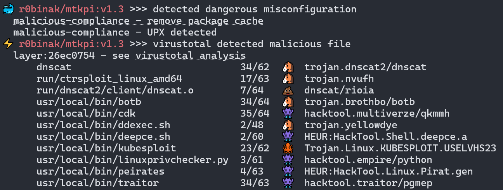

# Public OCI-Image Security Checker

## What is it?

PISC (Public OCI-Image or docker-image Security Checker) is a set of bash scripts that check the following:
* **malware** 🦠 (exploits 🐙, hack-tools 👾, backdoors 🐴, crypto-miners 💰, etc 💩) by [virustotal](https://www.virustotal.com/)
* exploitable critical **vulnerabilities** 🐞 by [trivy](https://github.com/aquasecurity/trivy) and [inthewild.io](https://inthewild.io/) (vulners.com optional)
* image **misconfigurations** 🐳 like [CVE-2024-21626](https://www.docker.com/blog/docker-security-advisory-multiple-vulnerabilities-in-runc-buildkit-and-moby/)
* old **creation date** 📆
* [non-version](https://docs.docker.com/engine/security/trust/#image-tags-and-dct) **tag** 🔄 (latest, etc)
  
It can be used to automatically check the security of public OCI-images before run them in a private environment or before using them as base images for CI/CD process.
<p align="center">
  
</p>

## Releases here:
* https://hub.docker.com/r/kapistka/pisc/tags
* [changelog](./changelog.txt)

## Usage

### Preparation
[Get API key](https://docs.virustotal.com/docs/please-give-me-an-api-key) for [virustotal](https://www.virustotal.com/). The standard free end-user account has limitations.

### Quick Start via Docker
```sh
docker run kapistka/pisc:latest /bin/bash ./scan.sh -delm --virustotal-key <virustotal-api-key> -i r0binak/mtkpi:v1.3
```

### Common Start
Look at the [Dockerfile](./Dockerfile#L4) to find dependencies. You need to install `trivy`, `skopeo`, `jq` and other packages depending on the distribution used.
```
Usage: ./scan.sh [flags] [image_link or image_list]

Flags:
  -d, --date                      check old build date (365 by default)
  --d-days int                    check old build date. Specify the number of days for old build date, example: --d-days 180
  -e, --exploits                  check exploitable vulnerabilities by trivy and inthewild.io
  -f, --file string               all images from file will be checked. Example: -f images.txt
  -h, --help                      print this help
  -i, --image string              only this image will be checked. Example: -i r0binak/mtkpi:v1.3
  -l, --latest                    check non-version tag (:latest and the same)
  -m, --misconfig                 check dangerous misconfigurations
  --trivy-server string           use trivy server if you can. Specify trivy URL, example: --trivy-server http://trivy.something.io:8080
  --trivy-token string            use trivy server if you can. Specify trivy token, example: --trivy-token 0123456789abZ
  -v, --version                   show version
  --virustotal-key string         check malware by virustotal.com. Specify virustotal API-key, example: --virustotal-key 0123456789abcdef
  --vulners-key string            check exploitable vulnerabilities by vulners.com instead of inthewild.io. Specify vulners API-key, example: --vulners-key 0123456789ABCDXYZ
```

## Use cases
```bash
# CVE-2024-3094 (XZ Utils) exploit
./scan.sh --virustotal-key <virustotal-api-key> -i r0binak/xzk8s:v1.1
════════════════════════════════════════
🦠 r0binak/xzk8s:v1.1 >>> virustotal detected malicious file
  layer:0f28dfeb
    https://www.virustotal.com/gui/file/0f28dfebbf3451ccfe3d5b11d17bc38cc8d1c4e721b842969466dc7989d835e3
    https://www.virustotal.com/gui/file/dc24581c3500b9640e03c7a4c14cd7c22f88c533b831a7f6a49aaf3ba39fcde4
  layer:230cc513
    https://www.virustotal.com/gui/file/230cc513debf36c5294ba6dd2babd27934bb231362cd8d916ea1c58e9495d38f
    https://www.virustotal.com/gui/file/935cfccfa8d31d0e03f2162e9b46b7f9df77db64efa2e4cfb4dbaebdf94be6d3
      root/liblzma.so.5.6.0.patch  32/66  🐴  trojan.xzbackdoor/cve20243094

# log4shell-vulnerability + exploit
./scan.sh -de --virustotal-key <virustotal-api-key> -i kapistka/log4shell:0.0.3-nonroot
════════════════════════════════════════
🦠 kapistka/log4shell:0.0.3-nonroot >>> virustotal detected malicious file
  layer:7c9ba75b
    https://www.virustotal.com/gui/file/7c9ba75bf4cd4302633e29eea466489cfc98273377d834bc7603f10572ca1e97
🐞 kapistka/log4shell:0.0.3-nonroot >>> detected exploitable vulnerabilities
  CVE             FIX      PKG
  CVE-2016-8735   2.12.2   org.apache.tomcat:tomcat-catalina
  CVE-2021-44228  2.15.0,  org.apache.logging.log4j:log4j-core
  CVE-2021-45046  2.3.1,   org.apache.logging.log4j:log4j-core
📆 kapistka/log4shell:0.0.3-nonroot >>> created: 2023-04-18. Find another image

# dangerous image build misconfiguration cve-2024-21626
./scan.sh -m -i r0binak/cve-2024-21626:v4
════════════════════════════════════════
🐳 r0binak/cve-2024-21626:v4 >>> detected dangerous misconfiguration
  CVE-2024-21626 runC Escape
    https://nitroc.org/en/posts/cve-2024-21626-illustrated/

# old image build + avaliable newest tags
./scan.sh -d -i alpine:3.10
════════════════════════════════════════
📆 alpine:3.10 >>> created: 2021-04-14. Last update: 2024-01-27
💡 alpine:3.10 >>> use a newer tags:
  3.10.0       3.10.1   3.10.2   3.10.3   3.10.4
  3.10.5       3.10.6   3.10.7   3.10.8   3.10.9
  3.11         3.11.0   3.11.2   3.11.3   3.11.5
  3.11.6       3.11.7   3.11.8   3.11.9   3.11.10
  3.11.11      3.11.12  3.11.13  3.12     3.12.0
  3.12.1       3.12.2   3.12.3   3.12.4   3.12.5
  3.12.6       3.12.7   3.12.8   3.12.9   3.12.10
  3.12.11      3.12.12  3.13     3.13.0   3.13.1
  3.13.2       3.13.3   3.13.4   3.13.5   3.13.6
  3.13.7       3.13.8   3.13.9   3.13.10  3.13.11
  3.13.12      3.14     3.14.0   3.14.1   3.14.2
  3.14.3       3.14.4   3.14.5   3.14.6   3.14.7
  3.14.8       3.14.9   3.14.10  3.15     3.15.0
  3.15.0-rc.4  3.15.1   3.15.2   3.15.3   3.15.4
  3.15.5       3.15.6   3.15.7   3.15.8   3.15.9
  3.15.10      3.15.11  3.16     3.16.0   3.16.1
  3.16.2       3.16.3   3.16.4   3.16.5   3.16.6
  3.16.7       3.16.8   3.16.9   3.17     3.17.0
  3.17.0_rc1   3.17.1   3.17.2   3.17.3   3.17.4
  3.17.5       3.17.6   3.17.7   3.18     3.18.0
  3.18.2       3.18.3   3.18.4   3.18.5   3.18.6
  3.19         3.19.0   3.19.1  

# check date by image file-system (inspect distroless-image no date return)
./scan.sh -d -i gcr.io/distroless/base@sha256:a7b658ab73a602056c08e38257e3da2cb131855803b29af4a30ccd09c1283ce9
════════════════════════════════════════
📆 gcr.io/distroless/base@sha256:a7b658ab73a602056c08e38257e3da2cb131855803b29af4a30ccd09c1283ce9 >>> created: 2023-02-22. Find another image
```

