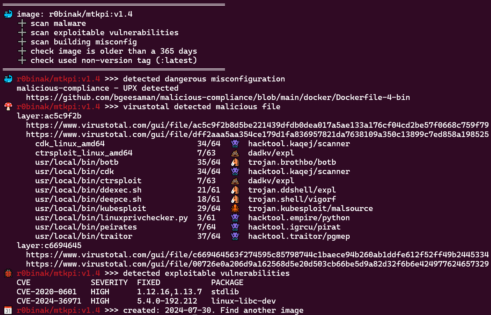

# Public OCI-Image Security Checker

## What is it?

PISC (Public OCI-Image or docker-image Security Checker) is command-line tool to assess the security of OCI container images.  
Exits with code `1` if any of the following conditions are met:
* **malware** 🍄 (exploits 🐙, hack-tools 👾, backdoors 🐴, crypto-miners 💰, etc 💩) by [virustotal](https://www.virustotal.com/)
* exploitable critical **vulnerabilities** 🐞 by [trivy](https://github.com/aquasecurity/trivy) and [inthewild.io](https://inthewild.io/) (vulners.com optional)
* image **misconfigurations** 🐳 like [CVE-2024-21626](https://www.docker.com/blog/docker-security-advisory-multiple-vulnerabilities-in-runc-buildkit-and-moby/)
* old **creation date** 📆
* [non-version](https://docs.docker.com/engine/security/trust/#image-tags-and-dct) **tag** ⚓ (latest, etc)
  
It can be used to automatically check the security of public OCI images before running them in a private environment or using them as base images in a CI/CD pipeline.
<p align="center">
  
</p>

## Releases here:
* https://hub.docker.com/r/kapistka/pisc/tags
* [changelog](./changelog.txt)

## Usage

### Preparation
[Get API key](https://docs.virustotal.com/docs/please-give-me-an-api-key) for [virustotal](https://www.virustotal.com/). The standard free end-user account has limitations.

### Quick Start via Docker
```sh
docker run kapistka/pisc:latest /bin/bash ./scan.sh -delm --virustotal-key <virustotal-api-key> -i r0binak/mtkpi:v1.4
```

### Common Start
Refer to the [Dockerfile](./Dockerfile#L4) for a list of dependencies. You need to install `trivy`, `skopeo`, `jq`, and other packages based on the distribution you are using.
```bash
Usage:
  $(basename "${BASH_SOURCE[0]}") [flags] [-i IMAGE | -f FILE | --tar TARFILE]  

Flags:
  -d, --date                      Check old build date (default: 365 days).
  --d-days <int>                  Specify the number of days for build date check. Example: `--d-days 180`.
  -e, --exploits                  Check for exploitable vulnerabilities using Trivy and inthewild.io.
  -f, --file <string>             Check all images listed in a file. Example: `-f images.txt`.
  -h, --help                      Display this help message.
  --ignore-errors                 Ignore errors from external tools and continue execution.
  -i, --image <string>            Check a specific image. Example: `-i r0binak/mtkpi:v1.4`.
  -l, --latest                    Check for usage of non-versioned tags (e.g., `:latest`).
  -m, --misconfig                 Check for dangerous image misconfigurations.
  --tar <string>                  Check a local TAR file containing image layers.
                                  Example: `--tar /path/to/private-image.tar`.
  --trivy-server <string>         Specify a Trivy-server URL for vulnerability scanning.  
                                  Example: `--trivy-server http://trivy.something.io:8080`. 
  --trivy-token <string>          Provide a Trivy-server API token. Example: `--trivy-token 0123456789abZ`.
  -v, --version                   Display version.
  --virustotal-key <string        Use VirusTotal API to scan for malware.
                                  Example: `--virustotal-key 0123456789abcdef`.
  --vulners-key <string>          Use Vulners.com API instead of inthewild.io for vulnerability scanning.  
                                  Example: `--vulners-key 0123456789ABCDXYZ`.

Examples:
  ./scan.sh --virustotal-key 0123456789abcdef -i r0binak/mtkpi:v1.3
  ./scan.sh -delm -i kapistka/log4shell:0.0.3-nonroot --virustotal-key 0123456789abcdef
  ./scan.sh -delm --trivy-server http://trivy.something.io:8080 --trivy-token 0123abZ --virustotal-key 0123456789abcdef -f images.txt

Additional Notes:
- To authenticate with a registry, refer to `scan-download-unpack.sh#L14`.  
- To configure exclusions for specific CVEs or other criteria, see `check-exclusion.sh#L5`.
```

## Usage in CI Pipelines
This utility can be integrated into a CI pipeline to perform a security scan on container images before pushing them to a private registry. Combine this step with image signing and automated registry pushing for a secure DevSecOps workflow. Below is an example configuration:
```yaml
security_scan:
  stage: security
  image: $SECURITY_IMAGE
  script:
    - |
      /bin/bash /home/nonroot/scan.sh -delm --virustotal-key $VIRUSTOTAL_API_KEY \
        --trivy-server $TRIVY_SERVER --trivy-token $TRIVY_TOKEN -f ${NEW_IMAGES_FILE}

      # Auto-approve: If the scan fails (exit code >0), the pipeline stops before reaching this point.
  rules:
    - if: $CI_PIPELINE_SOURCE == 'merge_request_event'
```

## Use cases
```bash
# CVE-2024-3094 (XZ Utils) exploit
./scan.sh --virustotal-key <virustotal-api-key> -i r0binak/xzk8s:v1.1
════════════════════════════════════════
🍄 r0binak/xzk8s:v1.1 >>> virustotal detected malicious file
   layer:0f28dfeb
     https://www.virustotal.com/gui/file/0f28dfebbf3451ccfe3d5b11d17bc38cc8d1c4e721b842969466dc7989d835e3
     https://www.virustotal.com/gui/file/dc24581c3500b9640e03c7a4c14cd7c22f88c533b831a7f6a49aaf3ba39fcde4
   layer:230cc513
     https://www.virustotal.com/gui/file/230cc513debf36c5294ba6dd2babd27934bb231362cd8d916ea1c58e9495d38f
     https://www.virustotal.com/gui/file/935cfccfa8d31d0e03f2162e9b46b7f9df77db64efa2e4cfb4dbaebdf94be6d3
       root/liblzma.so.5.6.0.patch  37/64  🐴  trojan.xzbackdoor/cve20243094
```
```bash
# log4shell-vulnerability + exploit
./scan.sh -delm --virustotal-key <virustotal-api-key> -i kapistka/log4shell:0.0.3-nonroot
════════════════════════════════════════
🍄 kapistka/log4shell:0.0.3-nonroot >>> virustotal detected malicious file
   layer:7c9ba75b
     https://www.virustotal.com/gui/file/7c9ba75bf4cd4302633e29eea466489cfc98273377d834bc7603f10572ca1e97
🐞 kapistka/log4shell:0.0.3-nonroot >>> detected exploitable vulnerabilities
   CVE             SEVERITY  FIXED                                 PACKAGE
   CVE-2016-8735   CRITICAL  6.0.48,7.0.73,8.0.39,8.5.7,9.0.0.M12  org.apache.tomcat:tomcat-catalina
   CVE-2018-1123   HIGH      2:3.3.9-9+deb8u1                      libprocps3
   CVE-2021-44228  CRITICAL  2.15.0,2.3.1,2.12.2                   org.apache.logging.log4j:log4j-core
   CVE-2021-45046  CRITICAL  2.16.0,2.12.2                         org.apache.logging.log4j:log4j-core
📆 kapistka/log4shell:0.0.3-nonroot >>> created: 2023-04-18. Find another image
```
```bash
# dangerous image build misconfiguration cve-2024-21626
./scan.sh -m -i r0binak/cve-2024-21626:v4
════════════════════════════════════════
🐳 r0binak/cve-2024-21626:v4 >>> detected dangerous misconfiguration
   CVE-2024-21626 runC Escape
     https://nitroc.org/en/posts/cve-2024-21626-illustrated/
```
```bash
# old image build + avaliable newest tags
./scan.sh -d -i alpine:3.10
════════════════════════════════════════
📆 alpine:3.19.0 >>> created: 2023-12-08. Last update: 2025-01-08
💡 alpine:3.19.0 >>> use a newer tags:
   3.19.1  3.19.2  3.19.3  3.19.4  3.19.5
   3.19.6  3.20    3.20.0  3.20.1  3.20.2
   3.20.3  3.20.4  3.20.5  3.21    3.21.0
   3.21.1  3.21.2
```
```bash
# check date by image file-system (inspect distroless-image no date return) and exploitable vulnerability
./scan.sh -de -i gcr.io/distroless/base@sha256:a7b658ab73a602056c08e38257e3da2cb131855803b29af4a30ccd09c1283ce9
════════════════════════════════════════
🐞 gcr.io/distroless/base@sha256:a7b658ab73a602056c08e38257e3da2cb131855803b29af4a30ccd09c1283ce9 >>> detected exploitable vulnerabilities
   CVE            SEVERITY  FIXED            PACKAGE
   CVE-2023-4911  HIGH      2.31-13+deb11u7  libc6
📆 gcr.io/distroless/base@sha256:a7b658ab73a602056c08e38257e3da2cb131855803b29af4a30ccd09c1283ce9 >>> created: 2023-02-22. Find another image
adb84c747d07:~$
```
```bash
# test malware image - https://artifacthub.io/packages/container/malware-cryptominer-container/malware-cryptominer-container
./scan.sh -delm --virustotal-key <virustotal-api-key> -i quay.io/petr_ruzicka/malware-cryptominer-container:3
════════════════════════════════════════
⚓ quay.io/petr_ruzicka/malware-cryptominer-container:3 >>> non-version tag
🍄 quay.io/petr_ruzicka/malware-cryptominer-container:3 >>> virustotal detected malicious file
   layer:5f001048
     https://www.virustotal.com/gui/file/5f001048b7f5930db63533ef3bfa090ac89e53f765a60269f471354ef3c3590a
     https://www.virustotal.com/gui/file/a683e6d41bb726b807825e0a514bbd712ae96eb9e7efdd152605564a778b1854
       usr/share/nginx/html/eicar/eicar.com.txt                       64/68  🧬  virus.eicar/test
       usr/share/nginx/html/eicar/eicarcom2.zip                       56/67  🧬  virus.eicar/test
       usr/share/nginx/html/malware/ILOVEYOU.vbs                      50/61  🐛  worm.loveletter/scriptworm
       usr/share/nginx/html/malware/Invoke-ConPtyShell.ps1            22/62  👾  hacktool.boxter/darius
       usr/share/nginx/html/malware/L0Lz.bat                          34/61  🐴  trojan.disabler/cdeject
       usr/share/nginx/html/malware/Linux.Trojan.Multiverze.elf.x86   44/67  🐴  trojan.gafgyt/mirai
       usr/share/nginx/html/malware/MadMan.exe                        36/62  🧬  virus.madman
       usr/share/nginx/html/malware/Melissa.doc                       55/63  🧬  virus.melissa/w97m
       usr/share/nginx/html/malware/Py.Trojan.NecroBot.py             33/64  🐴  trojan.python/necrobot
       usr/share/nginx/html/malware/Trojan.Java.Fractureiser.MTB.jar  31/65  🐴  trojan.java/fractureiser
       usr/share/nginx/html/malware/TrojanSpy.MacOS.XCSSET.A.bin      43/63  🐴  trojan.xcsset/xtesc
       usr/share/nginx/html/malware/Txt.Malware.Sustes.sh             37/62  💰  miner.zojfor/shell
       usr/share/nginx/html/malware/Unix.Downloader.Rocke.sh          38/62  🐴  trojan.zojfor/shell
       usr/share/nginx/html/malware/Unix.Malware.Kaiji.elf.arm        40/67  🐴  trojan.kaiji/ddos
       usr/share/nginx/html/malware/Unix.Trojan.Mirai.elf.m68k        44/67  🐴  trojan.mirai/bootnet
       usr/share/nginx/html/malware/Unix.Trojan.Mirai.elf.mips        47/67  🐴  trojan.mirai/gafgyt
       usr/share/nginx/html/malware/Unix.Trojan.Mirai.elf.ppc         47/66  🐴  trojan.gafgyt/mirai
       usr/share/nginx/html/malware/Unix.Trojan.Mirai.elf.sparc       44/66  🐴  trojan.mirai/gafgyt
       usr/share/nginx/html/malware/Unix.Trojan.Mirai.elf.x86_64      40/64  🐴  trojan.mirai/gafgyt
       usr/share/nginx/html/malware/Unix.Trojan.Spike.elf.arm         43/63  🐴  trojan.dofloo/rootkit
       usr/share/nginx/html/malware/Walker.com                        42/61  🧬  virus.walker/abraxas
       usr/share/nginx/html/malware/WannaCry.exe                      67/72  🔑  trojan.wannacryptor/wannacry
       usr/share/nginx/html/malware/Win.Trojan.Perl.perl              36/60  💩  Malware.Generic-Script.Save.169b6505
       usr/share/nginx/html/malware/Zloader.xlsm                      45/66  🐴  trojan.esls/zloader
       usr/share/nginx/html/xmrig/xmrig                               41/64  💰  miner.xmrig/lkoez
       usr/share/nginx/html/xmrig/xmrig-linux-static-x64.tar.gz       39/62  💰  miner.xmrig/json
```
